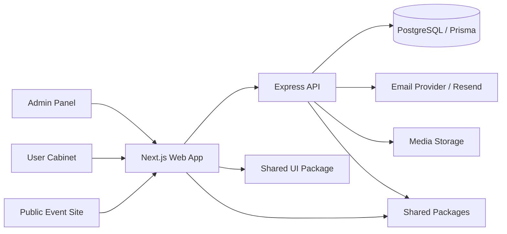

# EventHub

<p align="center">
  <b>Collaborative full-stack event-management platform</b><br />
  Next.js web app · Express API · Prisma/PostgreSQL · Admin panel · Teams · Volunteers · Analytics · Docker
</p>

<p align="center">
  <a href="https://nextjs.org/"></a>
  <a href="https://react.dev/"></a>
  <a href="https://www.typescriptlang.org/"></a>
  <a href="https://expressjs.com/"></a>
  <a href="https://www.prisma.io/"></a>
  <a href="https://www.postgresql.org/"></a>
  <a href="https://www.docker.com/"></a>
</p>

> **EventHub** is a collaborative project / contributed fork. The fork relationship is intentionally preserved so the real development history stays visible, including the commit and pull-request history that shows my work on the project.

## Overview

EventHub is a full-stack platform for managing public events. It includes a public event website, user registration, personal cabinet, team mechanics, volunteer applications, admin workflows, media management, analytics, email operations, and production-oriented deployment tooling.

The repository is organized as a TypeScript monorepo with a Next.js frontend, Express API, Prisma/PostgreSQL database layer, shared packages, Docker Compose runtime, and documentation for deployment and operational workflows.

## My contribution

Most of my work in this fork focused on making EventHub closer to a real event-management product rather than a static demo. The visible project history includes work across UI, backend APIs, database schema, admin workflows, production safety, testing, and deployment reliability.

Key areas I worked on include:

- improving the public event experience, cabinet/dashboard flows, and admin-facing UI;
- implementing and fixing media-bank flows, including public media layout, upload/runtime issues, and server/client boundaries;
- working on support features such as a global support mini-chat, support ticket flows, and user/admin support UX;
- strengthening admin tools for event management, users, teams, volunteers, email audiences, direct email flows, and analytics;
- extending Express/Prisma backend modules, validation, auth/RBAC behavior, and production-safe data handling;
- improving Docker, database, migration, seed, cleanup, CI/test, typecheck, and deployment-related reliability.

I keep this repository as a fork instead of re-uploading it so the collaboration context and real development history remain transparent.

## What this project demonstrates

- **Full-stack product development** with a Next.js frontend, Express API, shared packages, and PostgreSQL-backed data model.
- **Backend domain modeling** for events, users, roles, teams, volunteers, support, media, analytics, email, audit logs, and admin workflows.
- **Production-minded engineering**: environment contracts, Docker Compose, migrations, health/readiness checks, seed data boundaries, safe cleanup, and deployment runbooks.
- **Admin and operations tooling**: role-based admin panel, team/participant management, volunteer moderation, email operations, media bank, and analytics surfaces.
- **Reliability work**: type checking, linting, tests, CI/runtime fixes, server/client boundary fixes, and safer error handling.

## Architecture



## Main applications

| Area | Path | Purpose |
|---|---|---|
| Web app | `apps/web` | Next.js frontend for public pages, auth flows, user cabinet, admin panel, event pages, support, media, and analytics surfaces. |
| API service | `services/api` | Express + TypeScript backend for auth, events, teams, volunteers, admin workflows, media, analytics, email, support, and Prisma access. |
| Shared UI | `packages/ui` | Shared styles and UI primitives used by the web application. |
| Shared domain | `packages/shared` | Shared types, contracts, and utilities reused across frontend and backend. |
| Infrastructure | `infra`, Docker files, compose files | Runtime configuration, deployment support, Nginx/infra configs, Docker and production scripts. |
| Documentation | `docs` | Project notes, runbooks, deployment and architecture-related documentation. |

## Product modules

- Public landing page and event catalog with search, filters, pagination, and event detail pages.
- Email-based registration, login, refresh/logout flows, profile management, and protected routes.
- User cabinet with participations, team membership, event cabinet flows, and profile-related features.
- Team mechanics: creating teams, joining by mode, captain role, approval/rejection flows, member management, and change history.
- Volunteer applications with user status tracking and admin moderation.
- Admin panel for events, participants, teams, volunteers, event admins, platform users, roles, reports, and analytics.
- Media bank with uploads, moderation, public event galleries, captions, import jobs, and event media history.
- Support and communication features: support chat/tickets, admin support handling, email templates, broadcasts, recipients, and delivery tracking.
- Observability and reliability: structured logging, request IDs, health/readiness endpoints, safer errors, CI/runtime checks, and deployment validation.

## Tech stack

| Layer | Technologies |
|---|---|
| Frontend | Next.js, React, TypeScript, next-intl, Tailwind CSS, Zod |
| Backend | Express, TypeScript, Prisma Client, JWT, cookie-parser, CORS, Zod |
| Database | PostgreSQL 17, Prisma schema, migrations, seed scripts |
| Email / integrations | Resend, Svix, provider-aware email flows |
| Media | Local upload storage, media asset models, public media routes |
| Testing / quality | Vitest, Testing Library, Supertest, ESLint, TypeScript checks |
| Infrastructure | Docker, Docker Compose, production compose config, health checks, deployment scripts |
| Monorepo tooling | pnpm workspaces, Turbo, shared packages |

## Repository structure

```text
apps/
  web/               # Next.js frontend application
services/
  api/               # Express backend API and Prisma schema
packages/
  ui/                # Shared UI styles/components
  shared/            # Shared types and utilities
infra/               # Infrastructure configuration
docs/                # Documentation and runbooks
scripts/             # Deployment and maintenance scripts
```

## Quick start

### Requirements

- Node.js `>=24.0.0`
- pnpm `>=10.33.0`
- PostgreSQL 17 locally or through Docker

### Install dependencies

```bash
pnpm install
```

### Configure environment

```bash
cp .env.example services/api/.env
```

Set the required local values in `services/api/.env`, especially:

- `DATABASE_URL`
- `JWT_ACCESS_SECRET`
- `JWT_REFRESH_SECRET`
- `CORS_ORIGIN`
- email provider variables when using real email delivery

### Database setup

```bash
pnpm db:generate
pnpm db:push
pnpm db:seed
```

### Run locally

```bash
pnpm dev
```

Default local URLs:

| Service | URL |
|---|---|
| Web | `http://localhost:3000` |
| API | `http://localhost:4000` |
| Health | `http://localhost:4000/health` |
| Ready | `http://localhost:4000/ready` |

## Docker Compose runtime

The development compose file starts PostgreSQL, API, and Web containers:

```bash
docker compose up -d
```

Useful commands:

```bash
pnpm docker:up
pnpm docker:logs
pnpm docker:down
```

Docker defaults:

| Service | Port |
|---|---|
| Web | `3000` |
| API | `4000` |
| PostgreSQL | `5432` |

## Main scripts

| Command | Purpose |
|---|---|
| `pnpm dev` | Run API and Web together. |
| `pnpm dev:api` | Run only the API service. |
| `pnpm dev:web` | Run only the web app. |
| `pnpm build` | Build shared packages, API, and Web. |
| `pnpm typecheck` | Run TypeScript checks across the workspace. |
| `pnpm lint` | Run lint checks across the workspace. |
| `pnpm test` | Run package and app tests. |
| `pnpm db:generate` | Generate Prisma client. |
| `pnpm db:push` | Push Prisma schema for local development. |
| `pnpm db:deploy` | Apply migrations for deploy/runtime. |
| `pnpm db:seed` | Seed local development data. |

## API surface highlights

The API includes routes for:

- authentication and profile management;
- events, event detail pages, registrations, teams, and volunteer applications;
- admin event CRUD, users, event admins, participants, teams, volunteers, and analytics;
- support threads/messages and admin support workflows;
- media assets, event media gallery, captions, moderation, imports, and public media display;
- email templates, broadcasts, recipients, consent, delivery status, and webhook processing;
- health/readiness checks for runtime verification.

## Status

EventHub is an evolving event-platform foundation. Many product areas are implemented as working full-stack flows, while some modules remain actively evolving as platform primitives and production-readiness improvements.

## Why it matters for review

For recruiters or engineering reviewers, EventHub demonstrates practical exposure to:

- full-stack TypeScript development;
- monorepo organization and shared package boundaries;
- backend API design with Express, Prisma, and PostgreSQL;
- authentication, roles, permissions, admin workflows, and production safety;
- Dockerized local infrastructure and deployment-oriented configuration;
- real product workflows: events, teams, volunteers, support, media, analytics, and email operations.
